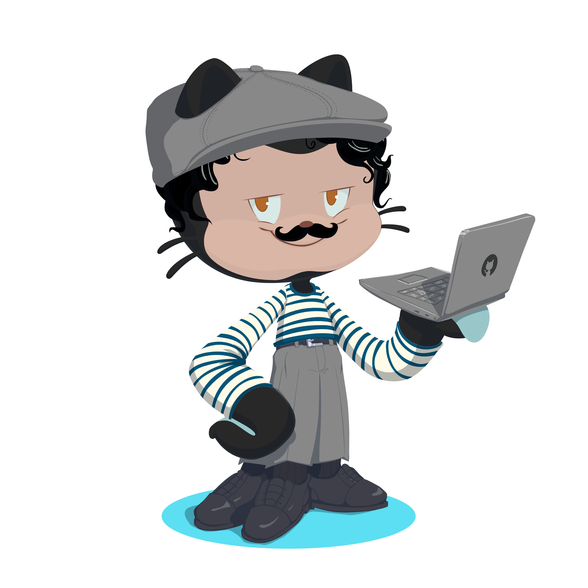

<h1 align="center" style="font-size:3em; background: linear-gradient(90deg, #4facfe, #00f2fe, #43e97b, #fef253); -webkit-background-clip: text; color: transparent; animation: gradientMove 5s ease infinite;">José Fernando Pires Serpa</h1>
<h3 align="center" style="color:#8892b0; margin-bottom:30px;">Fullstack Dev | Java + Angular</h3>

---

### ⚡ Stack

  

    
  

  

    
  

  

    
  

  

    
  

  

    
  

  

    
  

---

### 📊 Stats

  

    
  

  

    
  

---

### 🌐 Onde me encontrar

  <!-- LinkedIn -->
  <a href="https://www.linkedin.com/feed" target="_blank" style="text-decoration:none;">
    

      
    

  </a>

  <!-- Instagram -->
  <a href="https://www.instagram.com/nandelicia24" target="_blank" style="text-decoration:none;">
    

      
    

  </a>

  <!-- X / Twitter -->
  <a href="https://x.com/Nandelicia24" target="_blank" style="text-decoration:none;">
    

      
    

  </a>

  

 

