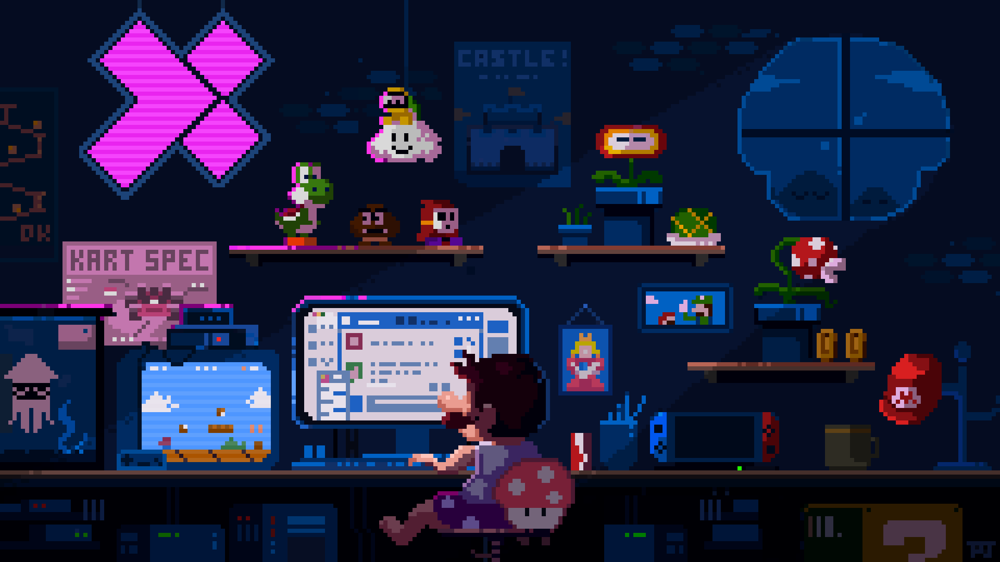

<!-- =================== TÍTULOS =================== -->
<h1 align="center" style="font-size:3.5em; 
    background: linear-gradient(90deg, #4facfe, #00f2fe, #43e97b, #fef253); 
    -webkit-background-clip: text; 
    color: transparent; 
    text-shadow: 2px 2px 8px rgba(0,0,0,0.6);
    margin-bottom:5px;">
 José Fernando Pires Serpa 
</h1>

<h3 align="center" style="color:#8892b0; font-size:1.6em; margin-bottom:20px;">
  🌐 Fullstack Dev | Java + Angular |👴23 |🇧🇷asília-DF
</h3>

<!-- =================== STACK =================== -->

  
  
  
  
  
  

<!-- =================== STATS =================== -->

<!-- =================== REDES SOCIAIS =================== -->

  
  

<!-- =================== GIFS E IMAGENS =================== -->

  

  

<h1 align="center">🚀 Roadmap Fullstack Developer</h1>

<i>Estudos & Evolução</i>

---

   
  
  
  
  
  

---

  🅠<b>Concluído:</b> Você terminou o módulo com sucesso. 
  🥈 <b>Em progresso:</b> Você está estudando e praticando o módulo. 
  🥉 <b>Noções básicas:</b> Já viu o essencial, mas ainda precisa aprofundar.

##

### 🌐 Fundamentos Web
- **HTML:** Tags básicas, links, imagens, listas, tabelas 🥈 
- **CSS:** Seletores, cores, fontes, box model  🥈
- **CSS:** Flexbox e Grid  🥈
- **JS:** Variáveis, operadores, loops, if/else  
- **Mini projeto:** Página pessoal simples  🏅
- **Git:** Commit, push  🏅

### 🖥️JavaScript Intermediário
- Funções, arrays, objetos  
- Eventos e DOM  
- ES6 (let/const, arrow functions)  
- **Projeto:** To-Do List  
- **Git:** Branching

### 🎨CSS e JS Avançado
- Animações, transições, pseudo-classes  🥈
- Layout responsivo (media queries)  🥈
- Fetch API, async/await  
- **Projeto:** Página interativa  
- **Git:** Merge e resolução de conflitos

###⚛️Angular Básico
- Estrutura do projeto, componentes, templates  
- Diretivas e pipes  
- **Projeto:** To-Do List com Angular

### 🔧Angular Intermediário
- Forms, validações, HTTP Client  
- Rotas, navegação  
- **Projeto:** Cadastro integrado com backend
  

### 🚀 Angular Avançado
- Lazy loading, Observables, RxJS  
- Testes unitários  
- **Projeto:** Dashboard interativo
  

### ☕Fundamentos Java
- Variáveis, tipos de dados, operadores  
- OOP básico: classes e objetos  
- **Projeto:** Calculadora simples
  

### 🛠️ Java Intermediário
- Arrays, listas, coleções  
- Manipulação de arquivos  
- Exceções  
- **Projeto:** CRUD básico
  

### 🏗️ Java Avançado
- Herança, polimorfismo, interfaces  
- Classes abstratas  
- **Projeto:** Sistema de cadastro completo
  

### 🗄️Banco de Dados SQL/Oracle
- SELECT, INSERT, UPDATE, DELETE  
- Joins, Stored Procedures, Triggers  
- **Projeto:** Sistema com backend Java + DB

### 🌀NoSQL (MongoDB/Firebase)
- CRUD em NoSQL  
- Integração com Angular/Java  
- **Projeto:** Sistema simples usando NoSQL
  

### 🏁Fullstack & Portfólio
- Angular + Java + DB completo  
- Deploy: Heroku/Netlify  
- Testes avançados, CI/CD  
- **Projeto final:** Blog ou e-commerce  
- Git: Versionamento avançado

---

